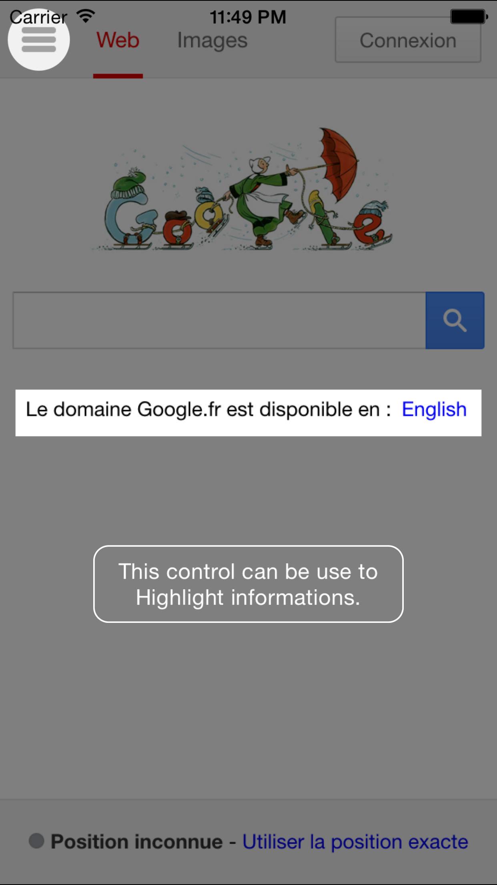

# JMHoledView
A view design to be filled with holes ...

HoleView, holes methods
---------------------------------------------------
```objc
- (NSInteger)addHoleCircleCenteredOnPosition:(CGPoint)centerPoint andDiameter:(CGFloat)diamter;
- (NSInteger)addHoleRectOnRect:(CGRect)rect;
- (NSInteger)addHoleRoundedRectOnRect:(CGRect)rect withCornerRadius:(CGFloat)cornerRadius;
- (NSInteger)addHCustomView:(UIView *)customView onRect:(CGRect)rect;
```


HoleView Delegation : JMHoledViewDelegate
---------------------------------------------------
This method will be called if you configure a holeViewDelegate.
The index is equal to NSNotFound if user touch dimingView.

```objc
- (void)holedView:(JMHoledView *)holedView didSelectHoleAtIndex:(NSUInteger)index;

```




